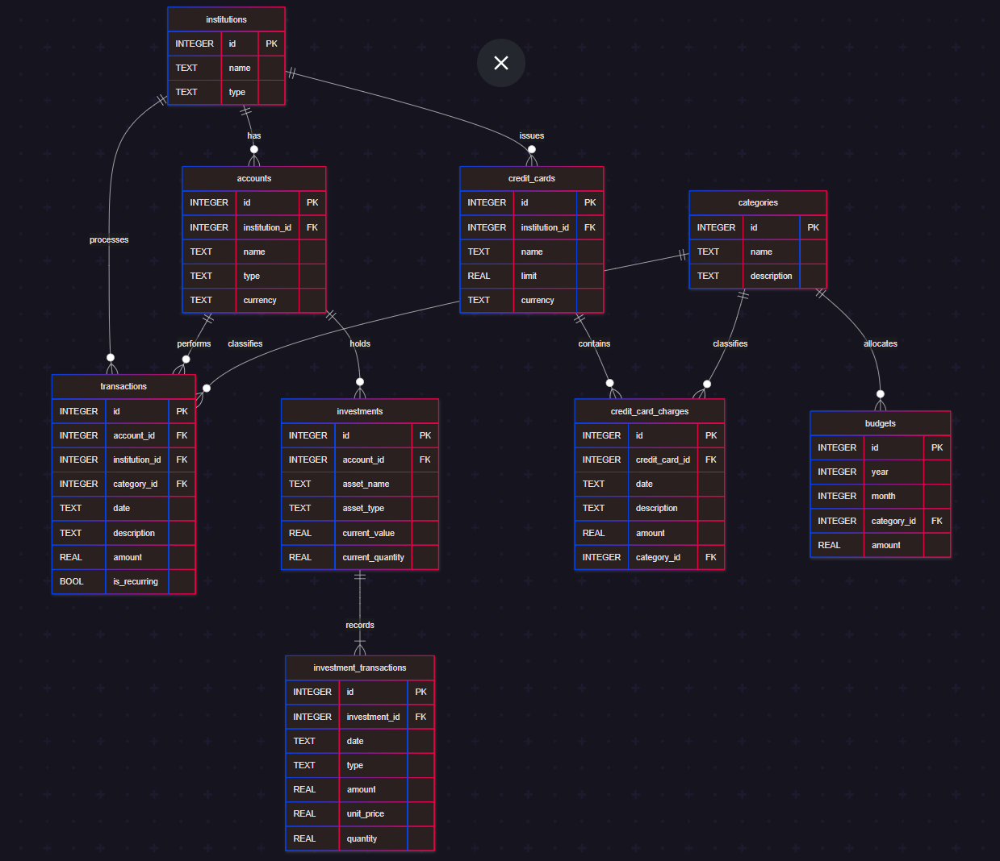

# 
Design Document - Final Project CS50 - SQL
# 
Personal Finance Tracker with SQLite

By LARISSA LEMOS
Github username: larissalemos
From: Uberlandia/Brazil

Video overview: <[URL HERE](https://www.youtube.com/watch?v=iAW12PBEWBU)>

## Scope

The "personal_finance" database stores data about personal expenditures, income and investments with the purpose of centralizing information from various accounts and institutions, facilitating the process of controlling one's financial life.

This database can be used by anyone who wants to set monthly budgets per month and per category of expediture and easily visualize whether this goal was met or not. It can also be useful for following up investment's rentability.

It includes 9 tables, according to below:
- Institutions, including basic information about the financial institutions to which the user has any kind of relationship
- Accounts, including basic identifying information about the account and its type
- Credit Cards, including which institution the card was issued by and its limit
- Credit Card Charges, including date, category, and other information about the charges
- Transactions, including information about the incoming and outcoming transactions in each account
- Investments, including information about the types of assets to help monitoring the rentability of each type
- Investments Transactions, including detailed information about each transaction related to the assets
- Categories, including information about the defined categories of interest of the user
- Budgets, including the budget by category and month to facilitate identifying whether the user is spending more or less than once intended

## Functional Requirements

With this database, the user may:

- Calculate the total of their expenditures over time and by pre defined categories;
- Calculate the total income over time;
- Compare the expenditures to the pre defined budget per period of time and category;
- Compare expenditures and income;
- Monitor the results of their investments per periods of time and type of investments

## Representation

Entities are captured in SQLite tables with the following schema.

### Entities

The database includes the following entities:

#### 1. Table: `institutions`
| Entity        | Type    | Constraints                          | Description                                  | Comments                     |
|---------------|---------|--------------------------------------|----------------------------------------------|------------------------------|
| id            | INTEGER | PRIMARY KEY                          | Unique institution identifier                | Auto-incrementing            |
| name          | TEXT    | NOT NULL                             | Name of financial institution                |                              |
| type          | TEXT    | NOT NULL, CHECK (valid types)        | Banks, Credit Unions, Insurance Companies, Investment Companies | Enforced valid values        |

#### 2. Table: `accounts`
| Entity         | Type    | Constraints                          | Description                        | Comments                     |
|----------------|---------|--------------------------------------|------------------------------------|------------------------------|
| id             | INTEGER | PRIMARY KEY                          | Unique account identifier          |                              |
| institution_id | INTEGER | NOT NULL, FOREIGN KEY                | Linked financial institution       | References institutions(id)  |
| name           | TEXT    | NOT NULL                             | Account name                       | User defined                 |
| type           | TEXT    | NOT NULL, CHECK (valid types)        | Checking, Saving, Investment, Other | Enforced valid values        |
| currency       | TEXT    | NOT NULL, DEFAULT 'BRL'              | Account currency                   | Defaults to Brazilian Real   |

#### 3. Table: `categories`
| Entity       | Type    | Constraints               | Description                   | Comments                     |
|--------------|---------|---------------------------|-------------------------------|------------------------------|
| id           | INTEGER | PRIMARY KEY               | Unique category identifier    |                              |
| name         | TEXT    | NOT NULL, UNIQUE          | Category name that refers to spendings  | Prevent duplicates. User defined.       |
| description  | TEXT    |                           | Detailed description          | Optional field               |

#### 4. Table: `transactions`
| Entity       | Type    | Constraints                          | Description                     | Comments                     |
|--------------|---------|--------------------------------------|---------------------------------|------------------------------|
| id           | INTEGER | PRIMARY KEY                          | Unique transaction identifier   |                              |
| account_id   | INTEGER | NOT NULL, FOREIGN KEY                | Linked account                 | References accounts(id)      |
| category_id  | INTEGER | NOT NULL, FOREIGN KEY                | Transaction category           | References categories(id)    |
| date         | DATE    | NOT NULL                             | Transaction date               | ISO format       |
| description  | TEXT    |                                      | Transaction notes              | Optional                     |
| amount       | REAL    | NOT NULL                             | Transaction amount             | Positive/negative values     |
| is_recurring | BOOLEAN |                                      | Recurring transaction flag     |                              |

#### 5. Table: `credit_cards`
| Entity         | Type    | Constraints                          | Description                     | Comments                     |
|----------------|---------|--------------------------------------|---------------------------------|------------------------------|
| id             | INTEGER | PRIMARY KEY                          | Unique card identifier          |                              |
| institution_id | INTEGER | NOT NULL, FOREIGN KEY                | Issuing institution             | References institutions(id)  |
| name           | TEXT    | NOT NULL                             | Card nickname                   | User-defined                 |
| limit          | REAL    |                                      | Credit limit                    | Optional                     |
| currency       | TEXT    | NOT NULL, DEFAULT 'BRL'              | Card currency                   | Defaults to BRL              |

#### 6. Table: `credit_card_charges`
| Entity         | Type    | Constraints                          | Description                     | Comments                     |
|----------------|---------|--------------------------------------|---------------------------------|------------------------------|
| id             | INTEGER | PRIMARY KEY                          | Unique charge identifier        |                              |
| credit_card_id | INTEGER | NOT NULL, FOREIGN KEY                | Linked credit card              | References credit_cards(id)  |
| date           | DATE    | NOT NULL                             | Charge date                     |                              |
| description    | TEXT    |                                      | Charge description              | Optional                     |
| amount         | INTEGER    | NOT NULL                             | Charge amount                   | Always positive              |
| category_id    | INTEGER | NOT NULL, FOREIGN KEY                | Spending category               | References categories(id)    |

#### 7. Table: `investments`
| Entity          | Type    | Constraints                          | Description                     | Comments                     |
|-----------------|---------|--------------------------------------|---------------------------------|------------------------------|
| id              | INTEGER | PRIMARY KEY                          | Unique investment identifier    |                              |
| account_id      | INTEGER | NOT NULL, FOREIGN KEY                | Holding account                 | References accounts(id)      |
| asset_name      | TEXT    | NOT NULL                             | Investment name (e.g., 'PETR4') |                              |
| asset_type      | TEXT    | NOT NULL                             | Asset class                     |                              |
| current_value   | REAL    |                                      | Current market value            | Updates frequently           |
| current_quantity| REAL    |                                      | Number of shares/units held     | Can be fractional            |

#### 8. Table: `investment_transactions`
| Entity         | Type    | Constraints                          | Description                     | Comments                     |
|----------------|---------|--------------------------------------|---------------------------------|------------------------------|
| id             | INTEGER | PRIMARY KEY                          | Unique transaction identifier   |                              |
| investment_id  | INTEGER | NOT NULL, FOREIGN KEY                | Related investment              | References investments(id)   |
| date           | DATE    | NOT NULL                             | Transaction date                |                              |
| type           | TEXT    | NOT NULL                             | Transaction type (buy/sell)     |                              |
| amount         | REAL    | NOT NULL                             | Total transaction value         |                              |
| unit_price     | REAL    |                                      | Price per unit                  |                              |
| quantity       | REAL    |                                      | Number of units traded          |                              |

#### 9. Table: `budgets`
| Entity       | Type    | Constraints                          | Description                     | Comments                     |
|--------------|---------|--------------------------------------|---------------------------------|------------------------------|
| id           | INTEGER | PRIMARY KEY                          | Unique budget identifier        |                              |
| year         | INTEGER | NOT NULL, CHECK (4 digits)           | Budget year                     |                              |
| month        | INTEGER | NOT NULL, CHECK (1-12)               | Budget month                    |                              |
| category_id  | INTEGER | NOT NULL, FOREIGN KEY                | Budget category                 | References categories(id)    |
| amount       | REAL    | NOT NULL                             | Budgeted amount                 |                              |

### Triggers
#### 1. `update_current_quantity_after_transaction`
- **When**: After a new line is inserted on investment_transactions
- **Action**: Updates investment quantity automatically after trades on investments
- **Purpose**: Maintains accurate quantity for each asset

#### 2. `prevent_negative_quantity`
- **When**: Before a new line is inserted on investment_transactions
- **Condition**: Before inserting a row where type = `sell`
- **Action**: Abort the transaction if the resulting quantity would be negative
- **Purpose**: Ensures data integrity

#### 3. `prevent_zero_transaction`
When: Before inserting a new row into the transactions table.

Condition: The trigger checks if the amount of the new transaction is equal to zero.

Action: If the amount is zero, the transaction is aborted and an error message is raised.

Purpose: This ensures data integrity by preventing transactions with no financial impact, which could indicate user error or unnecessary clutter in the dataset.

#### 4. `prevent_zero_credit_card_charge`
When: Before inserting a new row into the credit_card_charges table.

Condition: The trigger checks if the amount of the new credit card charge is equal to zero.

Action: If the amount is zero, the insertion is aborted and an error message is raised.

Purpose: This prevents invalid credit card charges that could cause confusion in reporting or inconsistencies in tracking card usage.

#### 5. `prevent_zero_investment_transaction`
When: Before inserting a new row into the investment_transactions table.

Condition: The trigger checks if the amount of the investment transaction is equal to zero.

Action: If the amount is zero, the insertion is aborted with an error message.

Purpose: This avoids the creation of meaningless investment transactions, which could interfere with performance tracking and portfolio analysis.

#### 6. `prevent_credit_limit_exceeded`
When: Before inserting a new row into the credit_card_charges table.

Condition: The trigger calculates the current total charges for the card and adds the new charge. If this sum exceeds the credit limit set in the credit_cards table for the given card, the condition is met.

Action: The transaction is aborted and an error message is raised, preventing the charge from being recorded.

Purpose: This enforces a business rule that protects against overspending beyond the credit limit, ensuring accurate and realistic modeling of financial constraints.

### Relationships

The below entity relationship diagram describes the relationships among the entities in the database.

As detailed in the diagram:

- The table institutions connects to three other tables. One institution can issue zero to many credit cards, can have zero to many accounts and can process zero to many transactions. Each of these three, must be connected to one and only one institution.
- The accounts performs zero to many transactions and holds zero to many investments. The user can have an account that has not been used yet. But each investment and transaction have to be connected to one and only one account.
- The investments record 1 to many investment transactions. An investment will only appear on the investments table if there is or was a transaction refered to that asset.
- Each credit card contains zero to many credit card charges. Each charge have to be connected to one and only one credit card.
- The table categories is defined by the user. It can classify zero to many transactions, credit card charges and budgets. But each of these three must be connected to one and only one category.
- The table budget is also defined by the user. It is only connected to categories.

## Optimizations

With the purpose of optimizing the queries, indexes and views where created.

### Views

#### 1. `total_spent`:
This view unifies all credit card transactions and negative direct transactions from all accounts, unifying all expenditures.

#### 2. `monthly_spending_per_category`:
This view groups all expenditures per month and category. 

## Limitations

This database was designed for educational purposes and focuses on a simplified model of personal finance. As such, it has some limitations:

- **No support for multiple users**: The current schema assumes data for only one user and does not include authentication or user-specific data segregation.

- **No currency handling**: All financial values are assumed to be in the same currency. There's no mechanism for tracking or converting multiple currencies.

- **No historical price tracking for assets**: Asset values are considered static at the time of transaction. There’s no way to analyze portfolio value over time based on market fluctuations.

- **No automation or integration**: The database does not connect to external sources (e.g., banks or stock markets) and requires manual data input.

These limitations could be addressed in future versions by expanding the schema, introducing user management, and integrating APIs for real-time financial data.
